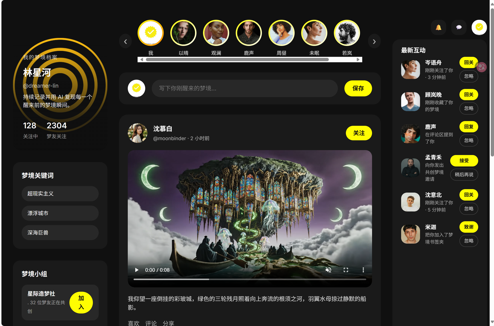
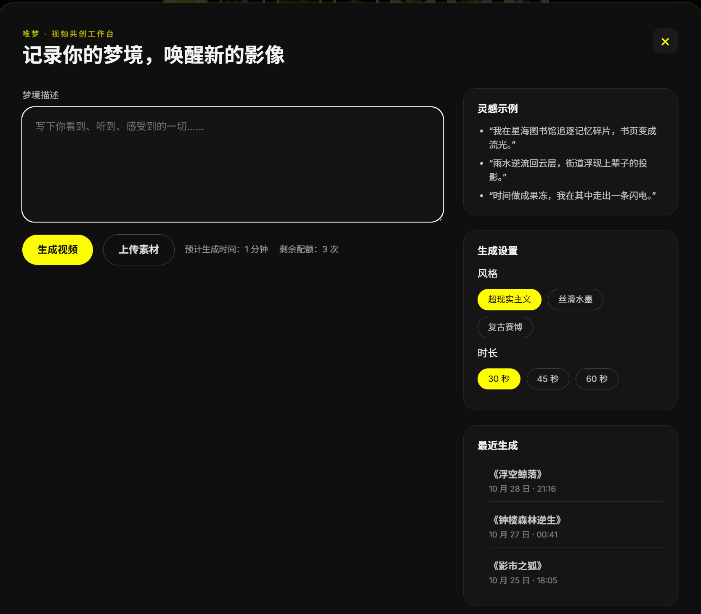
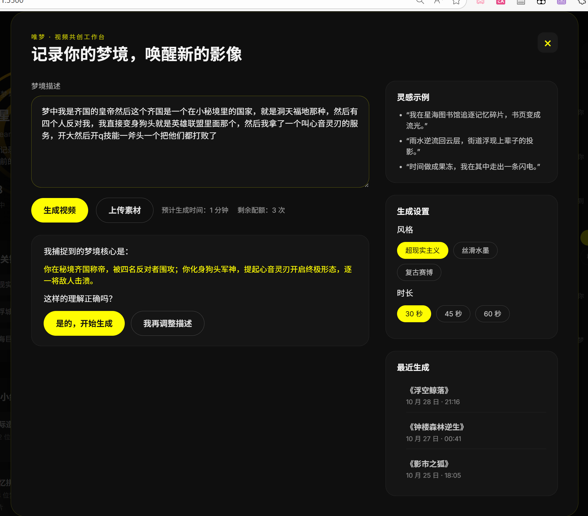
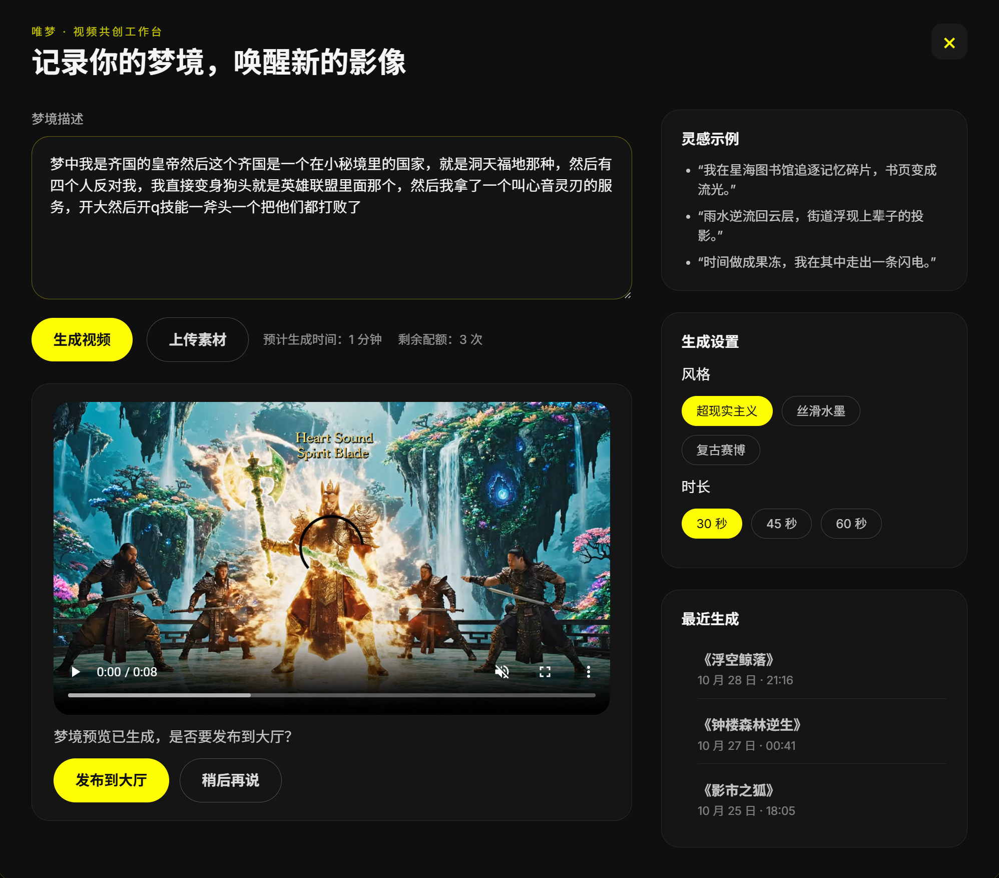

# 唯梦 WeDream · 交互式梦境共创原型

## 二、作品信息

- **作品名称**：唯梦 WeDream · 梦境共创工作台
- **作品简介**：这是一个围绕“记录梦境 → AI 共创 → 分享大厅”打造的互动原型，用户可以在沉浸式工作台描述梦境，体验 AI 意图确认与生成的全过程，并将视频作品发布到首页 Feed。它将设计稿中的关键动线在 Web 环境中复刻，实现从灵感记录到视觉呈现的完整闭环。
- **目标人群**：热衷记录梦境与内心故事的创作者、对超现实视觉内容感兴趣的社交平台爱好者、希望用 AI 放大灵感的设计师与内容生产者。
- **解决什么问题**：降低梦境记录与视觉化门槛，借助 AI 将抽象记忆快速转化为可分享的视频作品，并提供确认、预览、发布的一站式体验。

## 三、作品展示

- **桌面端页面原型**：`index.html` （开启本地静态服务器后访问）
- **核心交互演示视频**：  
  - `videos/齐国皇帝梦境变身狗头.mp4`  
  - `videos/倒挂彩色玻璃城市奇景.mp4`  
  - `videos/梦境二：怪诞集市视频生成.mp4`
- **产品设计文档**：`wedream-product-design.md`（包含愿景、用户旅程、数据模型）





部署链接：https://kk1355315.github.io/wedream/
## 📁 目录结构

```
.
├── index.html              # 页面结构 & 脚本
├── styles.css              # 全局样式与响应式配置
├── images/                 # 头像、活动、封面素材
├── videos/                 # 生成梦境示例视频
├── wedream-product-design.md # 产品第一性原理 / 用户旅程文档
└── figma.json              # 设计稿解析数据（供参考）
```

## 🧭 如何体验工作台流程

1. 点击首页中栏的“写下你刚醒来的梦境…”输入框，打开共创工作台。
2. 在文本框粘贴以下内容：
   ```
   梦中我是齐国的皇帝然后这个齐国是一个在小秘境里的国家，就是洞天福地那种，然后有四个人反对我，我直接变身狗头就是英雄联盟里面那个，然后我拿了一个叫心音灵刃的服务，开大然后开q技能一斧头一个把他们都打败了
   ```
3. 按照提示依次完成意图确认与生成步骤，等待短暂的“梦境构建中…”动画。
4. 查看生成的视频预览，点击“发布到大厅”即可在 Feed 顶部看到标记为“我的梦境”的新帖子。

> 目前仅对上述示例文案做了完整流程演示，其余内容会提示“功能正在训练中”。

